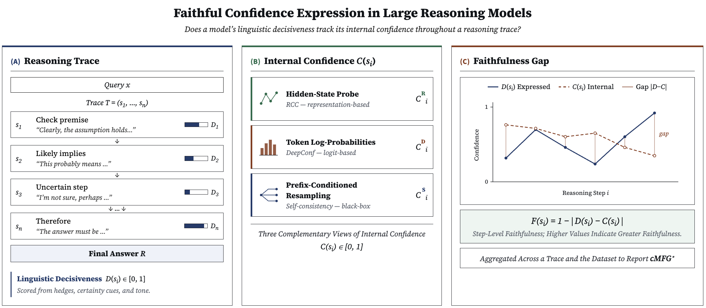

# Quantifying Faithful Confidence Expression in Large Reasoning Models

This repository provides code and analysis utilities for studying faithful confidence expression in large reasoning models (LRMs). The project evaluates whether a model's linguistically expressed confidence in its reasoning trace faithfully reflects its intrinsic uncertainty.

We introduce a framework for measuring faithful calibration in long-form reasoning traces by comparing linguistic decisiveness against three complementary intrinsic confidence estimators: representation-based confidence, token log-probability confidence, and sampling-consistency confidence. The framework is designed for reasoning models whose outputs contain long, dynamic chain-of-thought-style traces where confidence can shift across steps.

<p align="center">
    <a href="https://arxiv.org/pdf/2606.03969" style="display:inline-block;background-color:#2196F3;color:white;padding:10px 20px;text-align:center;text-decoration:none;font-size:20px;border-radius:5px;">📄 <b>Paper</b></a>
</p>

<p align="center">
  
</p>

Our experiments study faithful confidence expression across multiple reasoning-intensive datasets, model families, and prompt interventions. The results show that faithful confidence expression remains a persistent challenge for LRMs: reasoning behavior does not automatically imply better uncertainty expression, prompt interventions do not reliably repair faithful calibration, and different confidence estimators can give substantially different views of the same trace.

📄 **Paper**

Coming soon.

## Quick Links

- 🛠 [Installation](#-installation)
- 📂 [File Structure](#-file-structure)
- 📊 [Experiments](#-experiments)
- 📈 [Analysis](#-analysis)
- 📝 [Citation](#-citation)

## 🛠 Installation

Clone the repository:

```bash
git clone https://anonymous.4open.science/r/faithful_lrm
cd faithful_lrm
```

Create a Python environment:

```bash
python -m venv .venv
source .venv/bin/activate
```

On Windows PowerShell:

```powershell
python -m venv .venv
.venv\Scripts\Activate.ps1
```

Install the analysis dependencies:

```bash
pip install -r requirements.txt
```

Python 3.10 or 3.11 is recommended.

## 📂 File Structure

The current repository structure is:

```text
lrms_anon/
├── README.md
├── requirements.txt
├── experiment/
│   ├── __init__.py
│   ├── experiment_gpu.py
│   ├── run_decisiveness_genai.py
│   ├── dataset_utils.py
│   ├── deepconf.py
│   ├── metrics.py
│   ├── prompts.py
│   ├── rcc.py
│   ├── sampling.py
│   └── utils.py
├── analysis/
│   ├── __init__.py
│   ├── common.py
│   ├── run_all.py
│   ├── analyze_conf_bins_project.py
│   ├── analyze_conf_decisiveness_gap.py
│   ├── analyze_high_confidence_wrong_answers.py
│   ├── analyze_length.py
│   ├── analyze_quantitative_project.py
│   ├── analyze_quantitative2_project.py
│   ├── analyze_step_prompt_trajectory_curves.py
│   ├── analyze_suspicious_traces.py
│   ├── clustering_analysis.py
│   ├── dataset_level_clustering_analysis.py
│   ├── generate_dataset_plots.py
│   ├── generate_prompt_plots.py
│   └── outputs/
└── .gitignore
```

Main components:

- `experiment/`: Experiment-generation code for running model inference, confidence estimation, sampling consistency, and post-hoc decisiveness scoring.
  - `experiment/experiment_gpu.py`: Main GPU pipeline. It generates reasoning traces, computes DeepConf and RCC confidence, runs prefix-conditioned sampling consistency, and writes run-level outputs.
  - `experiment/run_decisiveness_genai.py`: Post-hoc Gemini-2.5-Flash decisiveness scorer. It fills decisiveness and faithfulness columns in existing run outputs generated by `experiment_gpu.py`.
  - `experiment/dataset_utils.py`: Dataset loaders, prompt builders, and dataset-specific answer scoring for AIME, HLE, SuperGPQA, LegalBench, and MuSR.
  - `experiment/deepconf.py`, `experiment/rcc.py`, `experiment/sampling.py`, `experiment/metrics.py`: Implement confidence estimators and faithfulness metrics.
  - `experiment/prompts.py`: Prompt-intervention registry.
  - `experiment/utils.py`: Shared formatting, answer extraction, model-loading, and reasoning-step utility functions used elsewhere in the code.
- `analysis/`: Analysis scripts for producing figures, tables, and diagnostic summaries.
  - `analysis/common.py`: Shared utilities for run discovery, metadata parsing, output paths, labels, and file lookup.
  - `analysis/run_all.py`: Convenience script for running the main analysis pipeline.
  - `analysis/outputs/`: Default directory for generated analysis outputs.

Expected result layout:

```text
real_results/
├── ds_8b/
│   ├── aime_b/
│   ├── aime_perc/
│   └── aime_msh_perc/
└── qwq_32b/
    ├── hle_b/
    ├── hle_perc/
    └── hle_msh_perc/
```

Each run folder should contain the relevant result files, such as:

```text
results_*_examples.xlsx
results_*_step_level.xlsx
summary.txt
```

## 📊 Experiments

The experiment code lives under `experiment/`. The main pipeline is designed for GPU execution with vLLM and HuggingFace Transformers. The post-hoc decisiveness scorer uses the Gemini Developer API and requires `GEMINI_API_KEY`. Python 3.10 or 3.11 is recommended; use a GPU machine with a CUDA setup compatible with `torch` and `vllm`. If your machine requires a specific CUDA wheel for PyTorch or vLLM, install the matching `torch`/`vllm` packages first, then install the remaining packages from `requirements.txt`.

Run a baseline experiment:

```bash
python experiment/experiment_gpu.py \
  --model deepseek-ai/DeepSeek-R1-Distill-Qwen-7B \
  --dataset aime \
  --run_name real_results/ds_8b/aime_b \
  --n 1000 \
  --hedge blank \
  --tp 1
```

Supported datasets are:

```text
aime
hle
supergpqa
legalbench
musr
```

Prompt interventions are controlled with `--hedge` and `--sys_prompt`. For example:

```bash
python experiment/experiment_gpu.py \
  --model Qwen/QwQ-32B \
  --dataset hle \
  --run_name real_results/qwq_32b/hle_perc \
  --n 1000 \
  --hedge perception \
  --tp 2
```

To run the metacognitive hedge system prompt condition:

```bash
python experiment/experiment_gpu.py \
  --model Qwen/QwQ-32B \
  --dataset hle \
  --run_name real_results/qwq_32b/hle_msh_perc \
  --n 1000 \
  --hedge perception \
  --sys_prompt ms_hedge \
  --tp 2
```

Useful options:

- `--k`: number of continuations per evaluated step for sampling consistency. Default: `10`.
- `--judge_model`: local model used to judge sampling consistency. Default: `Qwen/Qwen2.5-1.5B-Instruct`.
- `--skip_sampling`: run only generation, DeepConf, and RCC.
- `--only_sampling`: resume from an existing `_checkpoint_pass1.pkl` and run only sampling consistency.
- `--quantization`: vLLM quantization format, e.g. `awq` for compatible quantized checkpoints.

After generation, run decisiveness scoring:

```bash
export GEMINI_API_KEY=your_api_key_here

python experiment/run_decisiveness_genai.py \
  --run_dir real_results/ds_8b/aime_b \
  --concurrency 20 \
  --batch_size 500
```

The decisiveness script updates the existing example-level and step-level Excel files in place, then rewrites `summary.txt` with decisiveness and faithfulness metrics.

Each completed run directory should contain:

```text
results_*_examples.xlsx
results_*_step_level.xlsx
summary.txt
scatter_vs_decisiveness.png
correlation_heatmap.png
```

## 📈 Analysis

The analysis scripts read experiment outputs from `real_results/` and write generated figures, tables, and summaries to `analysis/outputs/`.

Run all main analyses from the repository root:

```bash
python analysis/run_all.py --repo-root . --real-results-dir real_results
```

To stop immediately if any script fails:

```bash
python analysis/run_all.py --repo-root . --real-results-dir real_results --stop-on-error
```

To speed up length-based diagnostics by saving only PNG files:

```bash
python analysis/run_all.py --repo-root . --real-results-dir real_results --png-only-length
```

Run selected analyses individually:

```bash
python analysis/analyze_conf_bins_project.py --repo-root . --real-results-dir real_results
python analysis/analyze_conf_decisiveness_gap.py --repo-root . --real-results-dir real_results --output-dir analysis/outputs/confidence_decisiveness_gap_analysis
python analysis/analyze_high_confidence_wrong_answers.py --repo-root . --real-results-dir real_results --output-dir analysis/outputs/wrong_confidence_percentile_bin_analysis
python analysis/analyze_length.py --root real_results --outdir analysis/outputs/faithfulness_length_plots_fast
python analysis/generate_dataset_plots.py --real-results-dir real_results --output-dir analysis/outputs/dataset_plots
python analysis/generate_prompt_plots.py --real-results-dir real_results --output-dir analysis/outputs/prompt_plots
```

Optional clustering analyses:

```bash
python analysis/dataset_level_clustering_analysis.py --root real_results --outdir analysis/outputs/clustering_output_dataset_points
python analysis/clustering_analysis.py --html results_dashboard.html --outdir analysis/outputs/clustering_output
```

Typical outputs include:

```text
*.png
*.pdf
*.csv
*.html
*.txt
```

Generated outputs are written under:

```text
analysis/outputs/
```

## 📝 Citation

If you find this repository useful, please cite our paper:

```bibtex
@misc{gani2026quantifying,
      title={Quantifying Faithful Confidence Expression in Large Reasoning Models}, 
      author={Areeb Gani and Asal Meskin and Gabrielle Kaili-May Liu and Arman Cohan},
      journal={arXiv preprint arXiv:2606.03969},
      year={2026},
      url={https://arxiv.org/abs/2606.03969}, 
}
```
